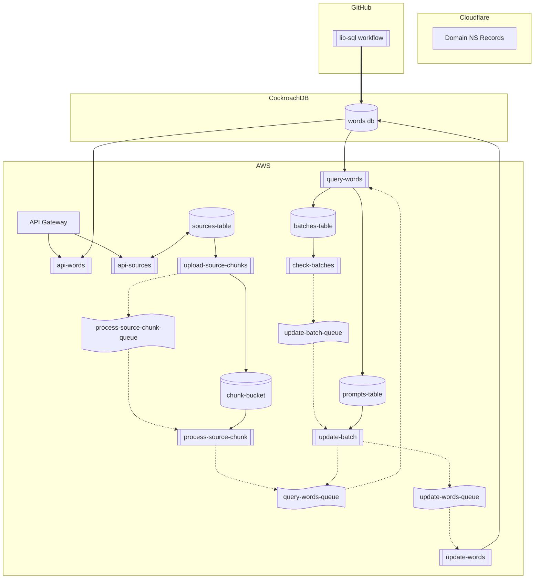

# infrastructure

## Description

This repository contains the Terraform code used to deploy the infrastructure used by the Word List application.

The infrastructure currently looks like this:

```mermaid
flowchart TD;
    subgraph Cloudflare
        dns[Domain NS Records]
    end
    subgraph CockroachDB 
        words_db[(words db)]        
    end
    subgraph GitHub 
        deployments[[lib-sql workflow]] ==> words_db
    end
    subgraph AWS
        api_gateway[API Gateway]

        api_words[[api-words]]
        api_sources[[api-sources]]    

        upload_source_chunks[[upload-source-chunks]]    
        process_source_chunk[[process-source-chunk]]
        query_words[[query-words]]

        check_batches[[check-batches]]
        update_batch[[update-batch]]
        update_words[[update-words]]

        chunk_bucket@{shape: lin-cyl, label: "chunk-bucket"}

        process_source_chunk_queue@{shape: paper-tape, label: "process-source-chunk-queue"}
        query_words_queue@{shape: paper-tape, label: "query-words-queue"}
        update_batch_queue@{shape: paper-tape, label: "update-batch-queue"}
        update_words_queue@{shape: paper-tape, label: "update-words-queue"}

        sources_table[(sources-table)]
        batches_table[(batches-table)]
        prompts_table[(prompts-table)]

        api_gateway --> api_words  
        api_gateway --> api_sources

        upload_source_chunks 
            -..-> process_source_chunk_queue 
            -..-> process_source_chunk
            -..-> query_words_queue
            -..-> query_words

        upload_source_chunks --> chunk_bucket --> process_source_chunk

        words_db --> api_words
        words_db --> query_words         

        sources_table <--> api_sources
        sources_table --> upload_source_chunks

        query_words --> batches_table
        query_words --> prompts_table

        batches_table 
            --> check_batches 
            -..-> update_batch_queue
            -..-> update_batch
            -..-> update_words_queue
            -..-> update_words --> words_db

        update_batch -..-> query_words_queue
        prompts_table --> update_batch


    end
```