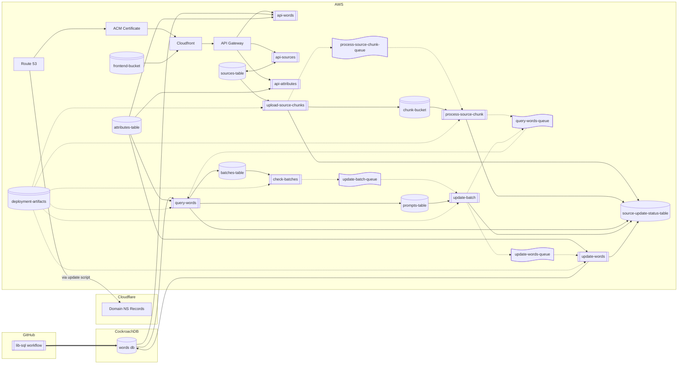

# infrastructure

## Description

This repository contains the Terraform code used to deploy the infrastructure used by the Word List application.

The infrastructure currently looks like this:

## Inputs

The Terraform has the following variables:

| Variable Name       | Description                                                                      | Type   | Default Value          | Nullable |
|---------------------|----------------------------------------------------------------------------------|--------|------------------------|----------|
| environment         | Deployment environment                                                           | string | staging                | No       |
| project             | Project name                                                                     | string | wordlist               | No       |
| region              | AWS region                                                                       | string | eu-west-2              | No       |
| domain              | The base domain name. A subdomain will be added for non-production environments. | string | N/A                    | No       |
| openai_api_key      | OpenAI API Key                                                                   | string | N/A                    | No       |
| openai_model_name   | OpenAI Model Name                                                                | string | N/A                    | No       |
| batch_poll_schedule | Schedule for batch polling in EventBridge format, e.g. rate(30 minutes)          | string | rate(30 minutes)       | No       |

Infrastructure is created using the environment and project names, so e.g. `update-words-queue` would be created as `wordlist-staging-update-words-queue` with the defaults above.

## Scripts

### init.sh

Sets up the state bucket and initialises the Terraform backend, creating the `backend.tf` file.

#### Environment Variables

| Variable Name        | Description                                          | Default Value |
|----------------------|------------------------------------------------------|---------------|
| LOG_FILE             | Log file for the script.                             | init.log      |
| ENVIRONMENT          | The environment name, e.g. staging                   | N/A           |
| PROJECT              | The name of the project.                             | wordlist      |
| REGION               | The AWS region infrastructure will be deployed to.   | eu-west-2     |

### update-dns.sh

Updates Cloudflare DNS NS records using the output from the Terraform deployment.

Uses `terraform output`, so will only work after the infrastructure has been applied.

#### Environment Variables

| Variable Name        | Description                                          | Default Value |
|----------------------|------------------------------------------------------|---------------|
| ZONE_ID              | The ID of the Cloudflare zone to be updated.         | N/A           |
| DOMAIN_NAME          | The name of the domain to be updated.                | N/A           |
| CLOUDFLARE_API_TOKEN | The Cloudflare API token to use when updating zones. | N/A           |

### update-lib-sql-connection-string.sh

Updates the connection string secret in a GitHub repository using the CockroachDB information from the Terraform deployment.

Uses `terraform output`, so will only work after the infrastructure has been applied.

#### Environment Variables

| Variable Name        | Description                                          | Default Value |
|----------------------|------------------------------------------------------|---------------|
| ENVIRONMENT          | The environment name, e.g. staging.                  | N/A           |
| SQL_REPO_NAME        | The name of the GitHub repo to be updated.           | N/A           |
| GH_TOKEN             | The GitHub API token to use when updating.           | N/A           |
| SQL_SECRET_NAME      | The name of the secret to be updated.                | N/A           |
